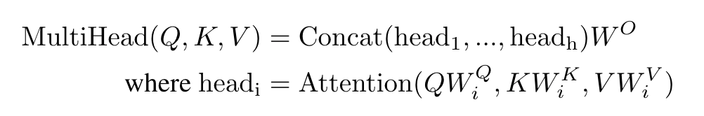

# Transformer: Decoder Implementation

[By Manpreet Singh](https://github.com/badlogicmanpreet/gpt/tree/main)

[

 
](images/transformer_exp.png)

## Motivation

I started delving into the intricacies of neural networks during my work on [mini-autograd](https://github.com/badlogicmanpreet/mini-autograd) and [mini-models](https://github.com/badlogicmanpreet/mini-models). Over time, I progressed to manually calculating the derivatives for each node in the neural layer and comparing them with PyTorch functions. This has been an engaging experience, mainly while working with a small network. Eventually, I began developing a small language model (decoder only) for text generation.

I initially began with a basic model using frequency as the foundation for generating the next token, similar to the Bigram model. Gradually, I started incorporating the decoder block from the transformer architecture, which was quite exciting. There's a lot to comprehend and visualize instinctively, and nothing beats implementing the underlying details.

## Design [WIP]

It's a simple design. I'll provide a brief overview. Keep [Transformer](https://github.com/badlogicmanpreet/gpt/blob/main/images/transformer.jpeg) & [Code](https://github.com/badlogicmanpreet/gpt/blob/main/src/transformer_decoder.py) open as a reference.

1. To begin, we define `tokens` and `position embeddings`. I utilize nn.Embedding for both, which is randomly initialized and will be learned over time. Token embeddings have a size equal to the number of tokens or vocabulary, with each embedding being of size n_embd. On the other hand, position embeddings have a size equal to the block size, where the block size is the length of each sequence. It's crucial to learn the spatial structure of each token in the sequence.

2. A `nn.Sequence serves as a container for adding Blocks and Layers`. We will briefly discuss the blocks. n_layer determines the number of blocks or layers added to the sequence. In our case, this is a variable that we can modify. Please refer to [sequence](https://pytorch.org/docs/stable/generated/torch.nn.Sequential.html) for more details.

3. What is a Block? `Block` in a transformer is best known where the Communication is followed by computation. There is quite a lot here 
Communication refers to the layer in which tokens interact with each other. This layer is called the Multihead Attention layer and is composed of multiple heads.
    1. `Head` class is the single Head of Self Attention.
    2. Multiple heads combined for `MutiHeadAttention`.
    [

 
](images/multihead_form.png)
    3. Let's understand the Head Class a bit more. This is where Self-Attention is developed. Go to the Section Transformer Head.
    4. Once you are done reading about the transformer head, it's time we look at the MultiHeadAttention. This is where we assemble multiple heads of self attention in parallel. 
        - Initialize nn.ModuleList to hold multiple Heads.
        - Under the forward method, pass the input through each head and finally concatenate on dimension -1.
                    [

 
](images/multihead.png)

    5. If you run the model at this point, the generation result could be better, although it shows little improvement.
    6. Once the tokens have communicated using Head and MultiHeadAttention, it's time to move to computation. The FeedForward layer handles the computation.
        - It is a simple layer followed by a non-linearity.
        - Initialize a nn.Sequence of Linear and RELU layers.
    7. Finally, the Block is the following
        - `x = x + self.sa(self.ln1(x))` # apply one head of self-attention `Communication`
        - `x = x + self.ffwd(self.ln2(x))` # apply feed forward layer `Computation`
        - Block combines Self Attention, a.k.a Communication, and Feed Forward network, a.k.a Computation.
    8. One important aspect within the Block is the Residual pathway. In the transformer image, look at the residual pathways. These are the arrows that go from input directly into the Add+Norm layer. Let's see why this is important. 
        - At a point where the neural networks are getting deeper and run into many optimization problems, we use an idea from the paper: You now add the skip or residual blocks. 
        - Refer to [Residual Blocks](https://towardsdatascience.com/residual-blocks-building-blocks-of-resnet-fd90ca15d6ec) article.
            [

 
](images/transformer-whole.png)
        - Linear projection on the residual pathways is essential so that the dimensions at the + are easy to add.
    9. Finally, a normalization layer and a linear layer are added.
	  
## Transformer Head: A Technical Overview [WIP]

The story begins by `unfolding the friendly relationships between words, a.k.a tokens, and a.k.a floating point values`. The human brain is a beautiful amalgamation of chemicals that magically store and understand the world, particularly the relationship between words. Although not everyone does . While teaching machines to generate coherent text or tokens, it is essential to utilize mathematical techniques and strategies to establish this relationship. The goal for a given input text is simple: we need to get the information from previous/future tokens in a given sequence. This information is super important for a particular token because it will be used to generate the next token or, rather, understand the relationship between the tokens for a given sequence.

The challenge is to establish a connection between tokens and maintain that information. Let's look at an example: T (sequence) = t1, t2, t3, t4, t5, -, -, -, - where t5 requires information from t1 to t5 to predict the next token. The most basic approach would be to calculate the average of t1 to t5 and input it to t5. Eventually, we also need to consider the spatial arrangement of tokens, known as positional encodings. More effective ways exist to create a cohesive system for tokens than simply averaging the information. We need a better solution. At this stage, it's helpful to delve into mathematics to understand how these tokens can effectively communicate.

At token t5, we should know which tokens in the past are most important for t5 and which ones are closely related. For example, vowels are interested in knowing about consonants in the past, and consonants are interested in knowing about vowels in the past.

`Self-attention` solves the problem of getting information in a data-dependent way! Each token will emit a query and key vector. 
- `Query vector`: what information am I looking for? 
- `Key vector`: what information do I contain? 

We get the affinities between the tokens now by doing a dot product between the Q and K's. So, the token t5's query will dot product with all the keys, which will become the wei (refer code). If the query and the key are aligned, they will have a very high amount. So, in the sequence, we now start learning the relationships/affinities between different tokens.
- Ultimately, `attention is just a communication mechanism`. It is a way to communicate between the tokens.
- Unlike convolutional neural networks, in its basic form, the attention mechanism does not have an idea about the position of the token (`a notion of space should be added`).
- Across batch dimensions, we are not communicating. We are communicating only within the batch dimension.
- Sometimes, like for sentiment analysis, all tokens can communicate with each other. We call this an encoder block. Do not make the future tokens as inf while using the triangular matrix.
- `transformer_decorder file implements the decoder block (nodes from the future never talk to the past nodes)`.
- Unlike self-attention, where k, q, and v are working on the same node pool, cross-attention can have q from one node pool and k and v from another node pool. In this case, q is pulling information from the second node pool.
- In the main attention formula, we also have to divide by sqrt(d_k). d_k is the head size, also called scaled attention. k and q are unit variance, i.e., unit Gaussian inputs. 'wei' will be unit variance, too. See below. 'Wei' is fed to Softmax. It's essential to keep the variance of wei near 1. If the variance is high, softmax will saturate, and if it is low, softmax will be very peaky.
            [

 
](images/attention.png)

## Acknowledgements & Inspiration

- Ashish Vaswani and the co-authors of the paper [Attention is All You Need.](https://proceedings.neurips.cc/paper_files/paper/2017/file/3f5ee243547dee91fbd053c1c4a845aa-Paper.pdf)
- Ramiro Hum-Sah (https://stats.stackexchange.com/users/303928/ramiro-hum-sah), Why are residual connections needed in transformer architectures?, URL (version: 2022-02-21): https://stats.stackexchange.com/q/565196
- Kaiming He and the co-authors of the paper [Deep Residual Learning for Image Recognition](https://arxiv.org/pdf/1512.03385)

*Model implementations, so profoundly inspired by Andrej Karpathy's legendary work in neural networks*

## License

This project is licensed under the MIT License. See the [LICENSE](LICENSE) file for more information.
