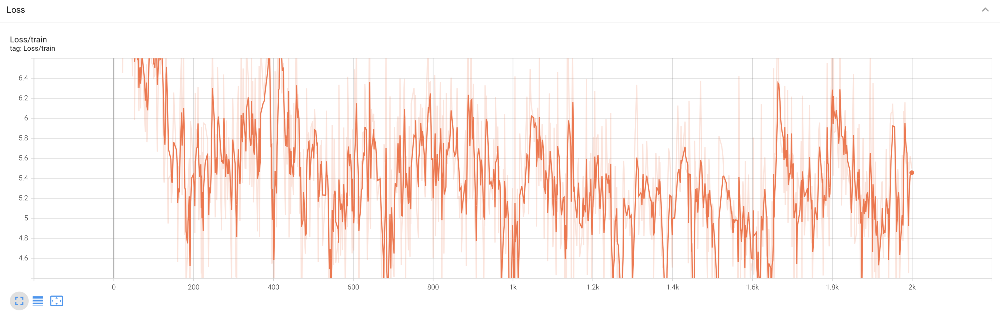

# One Step at a Time 📚

This document provides a beginner explanation for understanding and training GPT-2. I started by implementing a transformer decoder. You can visit [mini-autograd](https://github.com/badlogicmanpreet/mini-autograd) and [mini-models](https://github.com/badlogicmanpreet/mini-models) for my older work, and now I am slowly graduating to setting up, training, and using a Generative Pre-trained Transformer (GPT-2) model, starting with defining the model architecture, implementing the training loop, and generating text sequences. My learning rate is also 3e-4 because I need a steady caffeine drip! ✨

[Manpreet's GitHub repository](https://github.com/badlogicmanpreet/gpt) ☕

[<p align="center">
 </p>](images/gpt-2.png)

## Table of Contents
1. Introduction
2. Model Architecture
3. Training Loop
4. Text Generation
5. Loving the Floats
6. Model Visualization
7. Acknowledgements

## 1. Introduction

The aim is to thoroughly understand how to train a GPT-2 model from scratch. It leverages the PyTorch library and includes custom implementations of critical components like the attention mechanism and transformer blocks. Test on multiple chips like CPU, MPS and GPU is in progress.

The Transformer architecture, introduced in the paper "Attention is All You Need" by Vaswani et al., laid the groundwork for models like GPT-2. Here are the key differences between the generic Transformer architecture and GPT-2:

- **Attention Mechanism**: Both use self-attention mechanisms, but GPT-2 causally applies them to ensure tokens only attend to previous tokens in the sequence, maintaining the autoregressive property.
- **Layer Normalization and Activation**: GPT-2 employs layer normalization before the multi-head attention and feed-forward layers (pre-normalization), whereas the original Transformer does it after these layers (post-normalization).
- **Model Depth**: GPT-2 uses significantly more layers.

## 2. Model Architecture

The core architecture of the GPT-2 model is defined in several classes, including `GPT`, `Block`, and `CausalSelfAttention`.

#### `GPTConfig`

The `GPTConfig` class is designed to configure the essential parameters for a GPT model. It specifies a `block_size` of 1024, which determines the maximum sequence length that the model can process. The `vocab_size` is set to 50,257, accommodating 50,000 Byte Pair Encoding (BPE) tokens, 256 byte tokens, and an additional special token, ensuring comprehensive token representation. The model architecture is further defined by 12 transformer layers (`n_layer`), each incorporating 12 attention heads (`n_head`) to manage multiple attention mechanisms simultaneously. Additionally, the embedding dimension (`n_embd`) is set to 768, dictating the size of the vectors used to represent tokens. This configuration balances complexity and computational efficiency, making it suitable for training robust language models.

```python
@dataclass
class GPTConfig:
    block_size: int = 1024
    vocab_size: int = 50257
    n_layer: int = 12
    n_head: int = 12
    n_embd: int = 768
```

#### `CausalSelfAttention`

The `CausalSelfAttention` class is a crucial component in the GPT-2 model, implementing the self-attention mechanism. Upon initialization, it checks that the embedding dimension (`n_embd`) is divisible by the number of attention heads (`n_head`), ensuring a consistent split of dimensions across heads. The class defines linear transformations for key, query, and value projections (`c_attn`), as well as an output projection (`c_proj`). It registers a lower triangular matrix (`bias`) to enforce causality, ensuring that each position can only attend to previous positions, thus preventing information leakage from future tokens. 

In the forward method, the input tensor `x` is processed to extract batch size (`B`), sequence length (`T`), and embedding dimensionality (`C`). The input is projected into query (`q`), key (`k`), and value (`v`) tensors. These tensors are then reshaped and transposed to facilitate parallel processing across heads. The attention mechanism computes the dot product of queries and keys, scales it, and applies a causal mask to maintain temporal order. The softmax function normalizes these attention scores, which are then used to weight the values. Finally, the output is recombined and projected back into the original embedding space. This mechanism allows the model to focus on relevant parts of the input sequence, enhancing its ability to understand context and generate coherent text.

```python
class CausalSelfAttention(nn.Module):
    def __init__(self, config):
        super().__init__()
        assert config.n_embd % config.n_head == 0
        self.c_attn = nn.Linear(config.n_embd, 3 * config.n_embd)
        self.c_proj = nn.Linear(config.n_embd, config.n_embd)
        self.c_proj.GPT_SCALE_UNIT = 1
        self.n_head = config.n_head
        self.n_embd = config.n_embd
        self.register_buffer("bias", torch.tril(torch.ones(config.block_size, config.block_size))
        .view(1, 1, config.block_size, config.block_size))

    def forward(self, x):
        B, T, C = x.size()
        qkv = self.c_attn(x)
        q, k, v = qkv.split(self.n_embd, dim=2)
        k = k.view(B, T, self.n_head, C // self.n_head).transpose(1, 2)
        q = q.view(B, T, self.n_head, C // self.n_head).transpose(1, 2)
        v = v.view(B, T, self.n_head, C // self.n_head).transpose(1, 2)
        att = (q @ k.transpose(-2, -1)) * (1.0 / math.sqrt(k.size(-1)))
        att = att.masked_fill(self.bias[:, :, :T, :T] == 0, float('-inf'))
        att = F.softmax(att, dim=-1)
        y = att @ v
        y = y.transpose(1, 2).contiguous().view(B, T, C)
        y = self.c_proj(y)
        return y
```

#### `MLP`

The `MLP` class represents a simple feed-forward neural network with GELU (Gaussian Error Linear Unit) activation, designed to enhance gradient flow and learning. Unlike ReLU, which can suffer from "dying neurons" due to its flat gradient for negative values, GELU provides a smooth curve that improves gradient propagation. This activation function is also employed in other advanced models like BERT and GPT-2. The class consists of two linear layers: the first (`c_fc`) expands the embedding dimension to four times its size, while the second (`c_proj`) projects it back to the original embedding dimension. The forward method sequentially applies these linear transformations and the GELU activation, processing the input tensor `x` to produce the output. This design ensures efficient learning and better performance in handling complex data patterns.

```python
class MLP(nn.Module):
    def __init__(self, config):
        super().__init__()
        self.c_fc = nn.Linear(config.n_embd, 4 * config.n_embd)
        self.gelu = nn.GELU(approximate="tanh")
        self.c_proj = nn.Linear(4 * config.n_embd, config.n_embd)
        self.c_proj.GPT_SCALE_UNIT = 1
        
    def forward(self, x):
        x = self.c_fc(x)
        x = self.gelu(x)
        x = self.c_proj(x)
        return x
```

#### `Block`

The `Block` class is a fundamental component in the GPT-2 architecture, integrating self-attention and MLP (Multi-Layer Perceptron) modules with layer normalization and residual connections. Unlike the conventional transformer architecture where layer normalization follows the self-attention or MLP, GPT-2 positions layer normalization at the input of each sub-block, ensuring a clean residual path. This design choice facilitates smooth gradient flow from the top layers down to the input/token layer, enhancing learning efficiency. The class initializes with two layer normalization layers (`ln_1` and `ln_2`), a `CausalSelfAttention` module for token interaction, and an `MLP` for token-wise transformations. In the forward method, the input tensor `x` undergoes layer normalization followed by self-attention, and the result is added back to `x` as a residual connection. This process is repeated with the MLP, ensuring that each token is updated independently and effectively. The combination of these elements allows the block to efficiently aggregate information across tokens and update their representations, forming a robust building block for the overall model.

```python
class Block(nn.Module):
    def __init__(self, config):
        super().__init__()
        self.ln_1 = nn.LayerNorm(config.n_embd)
        self.attn = CausalSelfAttention(config)
        self.ln_2 = nn.LayerNorm(config.n_embd)
        self.mlp = MLP(config)

    def forward(self, x):
        x = x + self.attn(self.ln_1(x))
        x = x + self.mlp(self.ln_2(x))
        return x
```

#### `GPT`

The `GPT` class is the primary structure for the GPT-2 model, combining multiple components to form a complete transformer network for text generation. It starts by initializing essential elements: token and position embeddings (`wte` and `wpe`), a stack of transformer blocks (`h`), final layer normalization (`ln_f`), and the output linear layer (`lm_head`). These modules are organized in a `ModuleDict` for flexible access and management. The embeddings map input indices to dense vectors, while the transformer blocks apply self-attention and MLP operations to these embeddings, progressively refining the representations.

To ensure consistent and efficient learning, the class incorporates weight sharing between the token embeddings and the output layer, and initializes weights following the original GPT-2 model's methodology. During forward passes, the model processes input sequences by adding positional information to token embeddings and passing them through the transformer blocks. The final layer normalization and linear projection produce logits for the vocabulary, which can be used for text generation or computing the cross-entropy loss if targets are provided.

Additionally, the class includes a `from_pretrained` method, allowing users to load pretrained weights from Hugging Face models. This involves mapping and aligning parameters from the Hugging Face model to the custom GPT-2 model, ensuring compatibility and functionality. Overall, the `GPT` class encapsulates the architecture and operations needed to train and deploy a powerful language model.

```python
class GPT(nn.Module):

    def __init__(self, config):
        super().__init__()
        self.config = config
        self.transformer = nn.ModuleDict(dict(
            wte = nn.Embedding(config.vocab_size, config.n_embd),
            wpe = nn.Embedding(config.block_size, config.n_embd),
            h = nn.ModuleList([Block(config) for _ in range(config.n_layer)]),
            ln_f = nn.LayerNorm(config.n_embd),
        ))
        self.lm_head = nn.Linear(config.n_embd, config.vocab_size, bias=False)
        self.transformer.wte.weight = self.lm_head.weight
        # initialize the weights (use the code - https://github.com/openai/gpt-2/blob/master/src/model.py)
        self.apply(self._init_weights)

    # initialize the weights, taken from the original gpt2 model
    def _init_weights(self, module):
        if isinstance(module, nn.Linear):
            std = 0.02
            if hasattr(module, 'GPT_SCALE_UNIT'):
                std *= (2 * self.config.n_layer) ** -0.5
            torch.nn.init.normal_(module.weight, mean=0.0, std=0.02) 
            if module.bias is not None:
                torch.nn.init.zeros_(module.bias)
        if isinstance(module, nn.Embedding):
            torch.nn.init.normal_(module.weight, mean=0.0, std=0.02)
            
    def forward(self, idx, targets=None):
        B, T = idx.size()
        assert T <= self.config.block_size, "Cannot forward, model block size is exhausted"
        pos = torch.arange(0, T, dtype=torch.long, device=idx.device) # (T)
        pos_emb = self.transformer.wpe(pos)
        tok_emb = self.transformer.wte(idx)
        x = tok_emb + pos_emb
        for block in self.transformer.h:
            x = block(x)
        x = self.transformer.ln_f(x)
        logits = self.lm_head(x) # (B, T, vocab_size)
        loss = None
        if targets is not None:
            loss = F.cross_entropy(logits.view(-1, logits.size(-1)), targets.view(-1)) # cross entropy loss
        return logits, loss

    @classmethod
    def from_pretrained(cls, model_type):
        """Load pretrained model weights from Huggingface"""
        assert model_type in {'gpt2', 'gpt2-medium', 'gpt2-large', 'gpt2-xl'}
        from transformers import GPT2LMHeadModel
        print(f"Loading {model_type} weights...")

        config_args = {
            'gpt2': dict(n_layer=12, n_head=12, n_embd=768), # 124M Param
            'gpt2-medium': dict(n_layer=24, n_head=16, n_embd=1024), # 350M Param
            'gpt2-large': dict(n_layer=36, n_head=20, n_embd=1280), # 774M Param
            'gpt2-xl': dict(n_layer=48, n_head=25, n_embd=1600), # 1558M Param
            } [model_type]
        config_args['vocab_size'] = 50257 # GPT2 vocab size
        config_args['block_size'] = 1024 # GPT2 block size

        config = GPTConfig(**config_args)
        model = GPT(config)
        sd = model.state_dict()
        sd_keys = sd.keys()
        sd_keys = [k for k in sd_keys if not k.endswith('.attn.bias')]

        model_hf = GPT2LMHeadModel.from_pretrained(model_type)
        sd_hf = model_hf.state_dict()

        sd_keys_hf = sd_hf.keys()
        sd_keys_hf = [k for k in sd_keys_hf if not k.endswith('.attn.masked_bias')]
        sd_keys_hf = [k for k in sd_keys_hf if not k.endswith('.attn.bias')]
        transposed = ['attn.c_attn.weight', 'attn.c_proj.weight', 'mlp.c_fc.weight', 'mlp.c_proj.weight']
        assert len(sd_keys_hf) == len(sd_keys), f"mismatched keys: {len(sd_keys_hf)} != {len(sd_keys)}"
        for k in sd_keys_hf:
            if any(k.endswith(w) for w in transposed):
                assert sd_hf[k].shape[::-1] == sd[k].shape
                with torch.no_grad():
                    sd[k].copy_(sd_hf[k].t())
            else:
                assert sd_hf[k].shape == sd[k].shape
                with torch.no_grad():
                    sd[k].copy_(sd_hf[k])

        return model

```

#### `Check Device Type`

Detect the most suitable device for computation, prioritizing GPU usage if available. Initially, it sets the `device` variable to "cpu" as a default. It then checks if CUDA (NVIDIA's parallel computing platform) is available, and if so, sets the device to "cuda" for leveraging GPU acceleration. If CUDA is not available but the machine has Apple's Metal Performance Shaders (MPS) support, the device is set to "mps" to utilize Apple's GPU capabilities. Finally, it prints out the selected device. This approach optimizes performance by utilizing available hardware acceleration.

Ref: https://developer.apple.com/metal/pytorch/

```python
device = "cpu"
if torch.cuda.is_available():
    device = "cuda"
elif hasattr(torch.backends, 'mps') and torch.backends.mps.is_available(): # for apple mps
    device = "mps"
print(f"using device: {device}...")
```

#### `Data Loader`

`DataLoaderLite`, is used for handling text data in a format suitable for training a GPT model. Upon initialization, the class reads a text file from the specified path, encodes the text into tokens using the GPT-2 tokenizer from the `tiktoken` library, and stores these tokens as a PyTorch tensor. The size of each batch is defined by the parameters `B` (batch size) and `T` (sequence length). The class also calculates and prints the total number of tokens loaded and the number of batches per epoch based on the batch size and sequence length.

The `next_batch` method retrieves the next batch of data from the tokenized text. It extracts a buffer of tokens starting from the current position, creating input (`x`) and target (`y`) tensors by shifting the buffer by one token. The method then updates the current position for the next batch. If the next batch exceeds the length of the token list, the position is reset to the beginning, ensuring continuous looping through the dataset. This efficient, lightweight data loader facilitates seamless batch processing for training language models.

```python
class DataLoaderLite:
    def __init__(self, B, T):
        self.B = B
        self.T = T
        with open('text', 'r') as f:
            text = f.read()
        enc = tiktoken.get_encoding('gpt2')
        tokens = enc.encode(text)
        self.tokens = torch.tensor(tokens) # (B, T)
        print(f"loaded {len(self.tokens)} tokens")
        print(f"1 epoch = {len(self.tokens) // (B * T)} batches")
        self.current_position = 0

    def next_batch(self):
        B, T = self.B, self.T
        buf = self.tokens[self.current_position:self.current_position + B * T + 1] # (B, T)
        x = buf[:-1].view(B, T)
        y = buf[1:].view(B, T)
        self.current_position += B * T
        if self.current_position + B * T + 1 > len(self.tokens):
            self.current_position = 0
        return x, y
```

### 3. Training Loop

The basic training loop is decribed for a GPT-2 model using a custom data loader. First, it initializes a `DataLoaderLite` instance with a batch size (`B`) of 4 and a sequence length (`T`) of 32, which will supply the training data. Next, a GPT model is instantiated using the `GPTConfig` class and moved to the appropriate computational device (GPU or CPU) using the `model.to(device)` method.

An `AdamW` optimizer is set up with the model parameters and a learning rate of 3e-4. The training loop runs for 2000 iterations, where in each iteration, the next batch of data is retrieved from the data loader and transferred to the device. The gradients are reset with `optimizer.zero_grad()`, and a forward pass through the model computes the logits and loss. The backward pass (`loss.backward()`) calculates the gradients, and `optimizer.step()` updates the model's weights. Finally, the loss for each step is printed, providing a measure of the model's performance during training. This loop efficiently trains the GPT model by iteratively processing batches of data, computing gradients, and updating weights.

```python
train_loader = DataLoaderLite(B=4, T=32)
model = GPT(GPTConfig())
model.to(device)
optimizer = torch.optim.AdamW(model.parameters(), lr=3e-4)
for i in range(2000):
    x, y = train_loader.next_batch()
    x, y = x.to(device), y.to(device)
    optimizer.zero_grad()
    logits, loss = model(x, y)
    loss.backward()
    optimizer.step()
    print(f"step: {i}, loss: {loss.item()}")
```

### 4. Text Generation

The provided code snippet illustrates the process of generating text sequences using a trained GPT-2 model. Initially, the random seed for both CPU and GPU computations is set to ensure reproducibility. The input tensor `x` of shape (B, T) represents the number of sequences (`B`) and the sequence length (`T`). The goal is to extend each sequence to a specified maximum length (`max_length`).

In a loop, the model performs a forward pass to obtain logits (predicted probabilities for each token) without computing gradients, as specified by `torch.no_grad()`. The logits tensor, initially of shape (B, T, vocab_size), is reduced to (B, vocab_size) by selecting the logits of the last token in the sequence. These logits are then converted to probabilities using the softmax function.

To introduce randomness and diversity in the generated sequences, top-k sampling is employed. The top 50 token probabilities (`topk_probs`) and their corresponding indices (`topk_indices`) are extracted. A token is randomly selected from the top-k probabilities for each sequence using `torch.multinomial`, and the chosen token indices are gathered and appended to the sequences.

This process continues until the sequences reach the desired length. Finally, the generated sequences are decoded back into text tokens and printed. Each sequence is individually processed, converted from tokens to text, and displayed, demonstrating the model's ability to generate coherent text sequences based on the initial input.

```python
torch.manual_seed(42)
torch.cuda.manual_seed(42)
print(x.size())
while x.size(1) < max_length:
    with torch.no_grad():
        logits = model(x)
        logits = logits[:, -1, :]
        probs = F.softmax(logits, dim=-1)
        topk_probs, topk_indices = torch.topk(probs, 50, dim=-1)
        ix = torch.multinomial(topk_probs, 1)
        xcol = torch.gather(topk_indices, -1, ix)
        x = torch.cat((x, xcol), dim=1)

for i in range(num_return_sequences):
    tokens = x[i, :max_length].tolist()
    decoded = enc.decode(tokens)
    print(">", decoded)
```

### 5. Loving the Floats

Optimizing model performance involves understanding the trade-offs between precision and computational efficiency. When training with a single batch, you might notice that the loss starts high, around 10.5, and gradually decreases to as low as 0.002, indicating perfect overfitting on that batch.

`NVIDIA's A100 GPU` showcases how lower precision formats enhance performance. For instance, while `FP32 achieves 19.5 TFLOPS (trillion floating-point operations per second)`, FP16 and TF32 significantly boost this to 156 TFLOPS and 312 TFLOPS respectively. The smaller the number of bits used to represent numbers, the easier and faster data movement becomes. Consequently, `INT8, which offers 624 TFLOPS, is ideal for inference` due to its speed and equally spaced values, though it's not suitable for training which requires the flexibility of floating-point operations.

Despite the high speed of tensor cores in GPUs, their performance can be limited by memory bandwidth—the speed at which data is transferred to the cores. Achieving even 60% utilization of tensor cores is considered excellent due to these constraints.

`Matrix multiplications dominate our operations, especially in linear layers where tensor cores excel. Operations like GELU, LayerNorm, and softmax are comparatively shallow. Notably, the most computationally intensive task is transforming a 768-dimensional embedding to a 50257-dimensional vocabulary size.`

The concept of tensor float, introduced in the NVIDIA Ampere architecture, is key to this performance leap. Tensor float is a 23-bit floating point representation used by tensor cores, designed for rapid matrix multiplications in the format a * b + c, where a, b, and c are 4x4 matrices. Although this format reduces precision slightly, it remains adequate for training and enables tensor cores to operate up to eight times faster.

In summary, leveraging lower precision formats and understanding the computational constraints can significantly enhance model training efficiency, particularly when utilizing advanced hardware like NVIDIA's tensor cores.

#### `Floating Point in NVIDIA A100`

The NVIDIA A100 Tensor Core GPU introduces several enhancements for AI and HPC workloads, providing significant performance improvements:

- **TF32 (TensorFloat-32)**: TF32 is a new precision format that accelerates single-precision dense matrix multiplications. TF32 maintains the range of FP32 while providing improved performance
- **FP16 and Mixed Precision**: A100 supports FP16 for faster computations. Combined with automatic mixed precision, this allows for training with FP32 accuracy at FP16 speed.
- **Double Precision (FP64)**: Enhanced FP64 Tensor Cores deliver significant performance improvements for HPC applications.

    Reference: [NVIDIA A100 Datasheet](https://www.nvidia.com/content/dam/en-zz/Solutions/Data-Center/a100/pdf/nvidia-a100-datasheet-nvidia-us-2188504-web.pdf)

#### `Tensor Cores in NVIDIA Ampere Architecture`

Tensor Cores, introduced with the Volta architecture, have been significantly improved in the Ampere architecture:

- **Sparse Tensor Cores**: These allow for up to 2x performance improvement by leveraging sparsity in models.
- **Enhanced Precision**: Supports multiple precisions, including FP16, BFLOAT16, TF32, INT8, and FP64, optimizing for both training and inference workloads.

    Reference: [NVIDIA Ampere Architecture Whitepaper](https://images.nvidia.com/aem-dam/en-zz/Solutions/data-center/nvidia-ampere-architecture-whitepaper.pdf)

#### `Programming Tensor Cores with CUDA 9`

Programming Tensor Cores with CUDA 9 enables developers to take advantage of mixed-precision training, which can significantly speed up training times without sacrificing model accuracy. This involves using FP16 for computation and FP32 for accumulation, managed automatically by NVIDIA libraries.

Reference: [Programming Tensor Cores with CUDA 9](https://developer.nvidia.com/blog/programming-tensor-cores-cuda-9/)

### 6. Model Visualization

#### 1. **Histogram of Logits**:

</p>

This 3D-like chart is essentially a **histogram of logits** over time, likely across different epochs or training steps.

- **X-axis**: Represents the range of **logit values** (these are the raw outputs from your model, before applying softmax). 
- **Y-axis**: Likely represents **epochs or training steps**—you can see how the distribution of logits changes as training progresses.
- **Z-axis (or height of the peaks)**: Represents the **frequency** of logits in that range at a specific epoch/step. For example, you may see more logits concentrated around certain values at different points in training.

##### Observations:
- The early parts of the training show **narrow distributions** of logits (left side of the plot), which can indicate low model confidence in predictions.
- As training progresses (moving along the y-axis), the distribution starts to **spread out**, and logits begin covering a wider range of values. This suggests the model is becoming more confident and certain about its predictions, with logits spreading further from 0 (which corresponds to neutral predictions in many cases).
- If the logits are concentrated more to the right over time, that indicates stronger confidence in predictions.

This kind of plot helps to visualize how the model’s outputs are changing, with larger spreads of logits typically indicating more confident predictions, and more clustering around certain values indicating convergence in the learning process.

#### 2. **Loss Graph**:

<p align="left">

This is a simple **training loss curve**, which shows how the loss function (e.g., cross-entropy, mean squared error, etc.) changes over the course of training epochs.

- **X-axis**: Represents **training epochs** or steps.
- **Y-axis**: Represents the **loss value** at each epoch.

##### Observations:
- In the early part of the graph (left side), we see a **rapid decrease** in the loss, which is typical in the initial stages of training. The model is learning quickly, reducing its prediction errors.
- There is a **plateau and fluctuations** around the middle, where the loss value becomes more erratic. This could indicate a more difficult learning phase, perhaps because the model is fine-tuning its weights and the learning rate may be smaller.
- Towards the end (right side), there is some **leveling off of the loss**. If the loss remains relatively flat, it may mean the model is close to converging, but the fluctuations suggest the model could be under- or overfitting, depending on the validation loss behavior (not shown here).

#### Key Insights:
- The **logit histogram** shows your model's confidence growing over time, as indicated by the spread of logits. The wider range means the model is assigning more diverse (and possibly more confident) scores to its predictions.
- The **loss curve** generally follows a decreasing trend, but the fluctuations suggest that there could be further improvements with techniques like adjusting the learning rate, using learning rate schedules, or regularization to stabilize training.

### 7. Acknowledgements

This project draws inspiration from several key works in the field of deep learning and transformers, including the seminal paper "Attention is All You Need" by Vaswani et al. and `Andrej Karpathy's` contributions to neural networks.

# Conclusion

This document offers a fun-sized guide to kickstart your `GPT-2` training journey, explaining the model architecture, training loop, and text generation process. Follow along, and who knows—you might just become the next AI whisperer! 🚀🤖✨

For further information and the complete code, refer to the project's [MS GitHub repository](https://github.com/badlogicmanpreet/gpt).